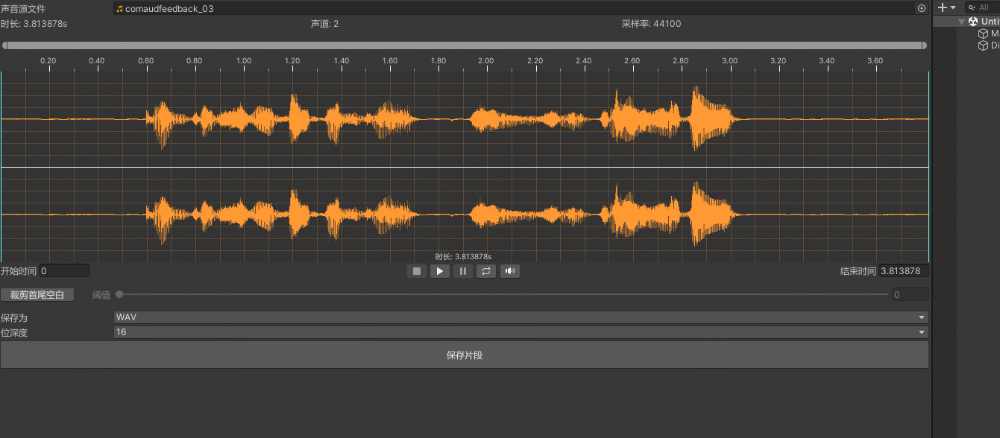
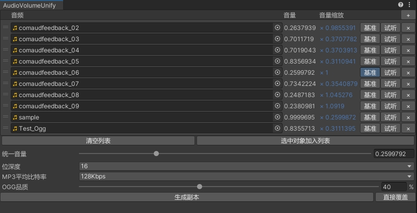

## AudioClipper

支持展示AudioClip对象的波形图，从中截取片段，试听并保存为WAV、MP3、OGG文件。  

* 展示带标尺的波形图。
* 可在波形图中选中截取区域，并支持拖动区域。
* 可根据阈值裁剪收尾空白。
* 可试听截取的片段。
* 可缩放音量，并在波形图中展示出来。
* 可保存片段到WAV、MP3、OGG等音频文件。

## AudioVolumeUnify

本工具用于将多个音频统一音量，支持WAV、MP3、OGG三种格式。  

* 可选择某个音频的音量作为统一音量，也可以自己设置统一音量。
* 支持以统一音量试音每个音频。
* 输出文件与源文件格式相同，也可以直接覆盖源文件。

## 第三方内容

Editor/Lame：[Lame-For-Unity](https://github.com/3wz/Lame-For-Unity)  
    取自 [Assets/Lame](https://github.com/3wz/Lame-For-Unity/tree/master/Assets/Lame) ，有所删减。  

Editor/VorbisPlugin：[unity-project-vorbis](https://github.com/gindemit/unity-project-vorbis)  
    取自 [Assets/VorbisPlugin](https://github.com/gindemit/unity-project-vorbis/tree/master/UnityClient/Assets/VorbisPlugin) 。  