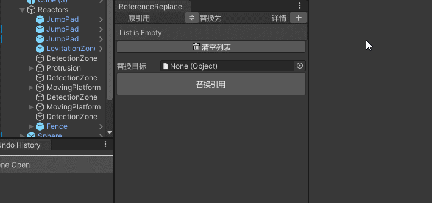
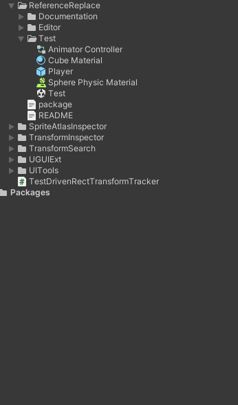

## ReferenceReplace

设置一组映射关系列表，将目标内所有对列表左边的引用替换为列表右边。  
如果目标是个场景内对象，则通过遍历引用进行替换。  
如果目标是个资源文件，则通过文本替换的方式替换对应GUID和FileID。  
如果目标是个文件夹，则遍历文件夹里所有资源文件进行替换。  
  
* **列表：** 原对象和替换为的映射表。  
* **交换按钮：** 在列表标题栏「原对象」与「替换为」之间的按钮，点击可以交换整个列表的左右两边。  
* **详情：**  
    * 列表行左右两边对象的类型毫无关系时，会出现警告图标，提示检查对象类型。  
    * 列表行左右两边对象都是GameObject时，会出现按钮，点击可将两个GameObject都拥有的组件加入映射列表。  
* **列表支持拖放：**  
    * 可选中多个对象，拖放到列表左半边或者右半边非ObjectField处，列表高亮区域将被覆盖。  
    * 拖放时按住Ctrl键，变为插入模式，选中的对象将被插入列表指定位置。  
* **操作目标：** 可以是场景内的GameObject，也可以是一个文件夹或资产文件。  
    * 如果目标是个场景内对象，则通过遍历引用进行替换。  
    * 如果目标是个以 YAML 格式储存的资产文件，则以文本形式打开文件，搜索GUID和FileID并替换保存。  
    * 如果目标是个非Unity序列化资产文件，则以文本形式打开meta文件，搜索GUID和FileID并替换保存。  
    * 如果目标是个文件夹，则遍历文件夹内所有文件，对每个资产文件进行操作。  

## AssetsDeepCloner

深拷贝资产——对多个目标资产建立副本，并在副本中保留相互之间的引用关系，而不是引用原文件。  
实现方式：  
1. 将所有原资产的GUID与new出来的新GUID一对一建立映射关系。  
2. 将原资产文件和对应的meta文件克隆。  
3. 根据映射关系，将修改克隆得到的meta文件内的GUID改为新的GUID。  
4. 在克隆得到的资产文件内搜索原资产的GUID并替换为新GUID。  
  
在需要拷贝的单个或若干个资产处右键，点击「克隆(复制内部依赖)」，即可进行深拷贝。  