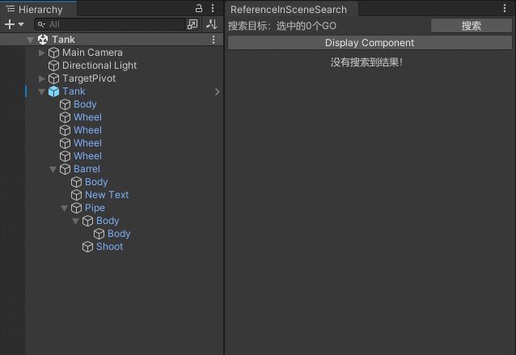
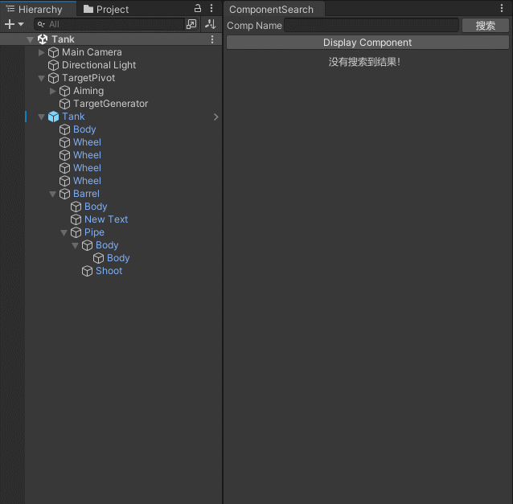

## TransformSearch

内含多种搜索，搜索结果以节点树的形式呈现。  
可继续扩展搜索条件。  
  
  
* **组件搜索：** 以选中目标为搜索范围（支持多选，支持Prefab编辑场景，支持Prefab资产），将范围内所有匹配的组件显示出来。  
* **Layer搜索：** 以选中目标为搜索范围（支持多选，支持Prefab编辑场景，支持Prefab资产），将范围内所有匹配的节点显示出来。  
* **场景中引用搜索：** 以整个场景为搜索范围（支持Prefab编辑场景），将范围内所有引用到所选对象（支持多选）的组件显示出来。  