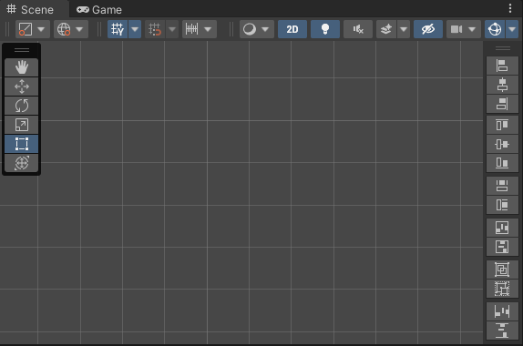

## UITools

提供对齐、同宽高、贴合、成组解组、平均行间距等操作，用于更方便地编辑UGUI。  
  
下图是在Unity2021.3里的样子，停靠在Scene窗口右侧工具栏里。  
  
由于在Unity2021.2及以上版本才有Overlay，所以在Unity旧版本的工程中，本工具是一个EditorWindow。  
下图是在Unity2019.4里的样子，停靠在Scene窗口右侧或下侧。  
  
* **对齐按钮：** 分为「上」、「中」、「下」、「左」、「中」、「右」共6个按钮。  
  当选中单个UI节点，则将该节点与父节点对齐。当选中多个UI节点，则将其他节点与第一个节点对齐。  
  当按住Shift键再点击时，会同时设置节点的轴点。  
* **同宽高按钮：** 分为「同宽」和「同高」共2个按钮。  
  当选中单个UI节点，则将该节点与父节点同宽高。当选中多个UI节点，则将其他节点与第一个节点同宽高。  
* **贴合按钮：** 分为「水平贴合」和「竖直贴合」共2个按钮。  
  将选中节点的宽高设置为包裹所有子节点的最小尺寸，由于子节点的范围不一定剧中，所以会移动节点坐标。  
  当按住Shift键再点击时，会保持节点坐标，转而修改节点的轴点。  
* **组按钮：** 分为「成组」和「解组」共2个按钮。  
  成组：在当前位置新建一个名为「Group」节点，并将选中的一个或多个节点设为该节点的子节点。  
  解组：如果选中的节点名称为「Group」，则将其所有子节点设为该节点的父节点的子节点，并删除该节点。  
* **行间距按钮：** 分为「平均间距」和「平均行距」共2个按钮。  
  平均间距：以选中的多个节点的最左边节点和最右边节点为两端，平均分布节点间的间距。  
  平均行距：以选中的多个节点的最下边节点和最上边节点为两端，平均分布节点间的行距。  
  当按住Shift键再点击时，将会重新定义缝隙（广义缝隙）。  