# 一些自创小工具

本仓库用于存放一些自创的小工具、对Unity的实用扩展、对第三方插件的扩展等。  
本插件库从0.1.0版本到0.1.1版本改过包名，如果要跨该版本升级，请先删除本仓库，然后重新安装（更方便的做法是直接修改manifest.json文件中相应的包名，将 _ 改为 - ）。

#### 安装方法
* 方法1：使用Unity Package Manager安装：  
  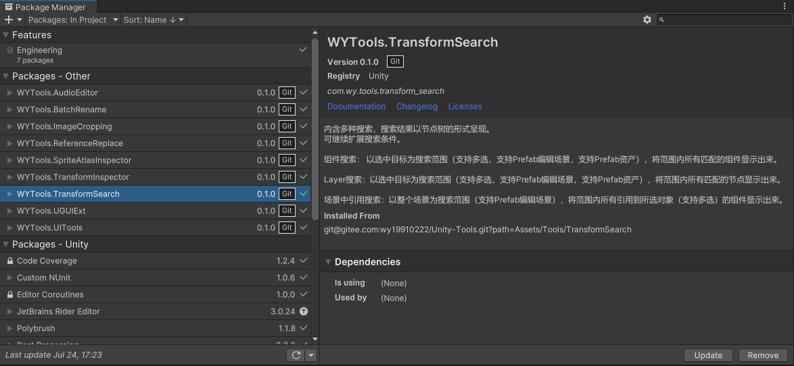  
  本仓库大部分工具都支持使用UPM进行安装，下述每个工具的说明中都附有UPM安装地址，但也有两个例外：  
  * 由于依赖的第三方库没有做成UPM包，导致本仓库的工具无法做成UPM包。如： **EasySplinePath2DPlus** 。  
  * **Unity2020** 只有 **2020.3.47f1** 及之后的版本才支持 **?path=/folder1/folder2** 的形式指定存储库子文件夹中的包，所以如果是 **2020.1.0f1 ~ 2020.3.46f1** 之间的版本，无法通过UPM安装。

* 方法2：文件夹拷贝至项目中。  


## 批量重命名

[**BatchRename**](Assets/Tools/BatchRename)  
支持重命名GameObject和Asset。  
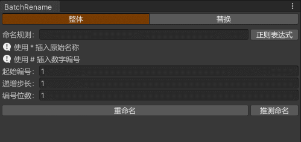  
* **整体：** 重命名为新的名称。  
* **替换：** 将原名中的一部分替换成别的字符串。  
* **「正则表达式」复选按钮：** 整体重命名时，用来将与原名匹配到的字符串插入到新名称中，替换重命名时，用来匹配需要替换的内容。  
* **起始编号、递增补偿、编号位数：** 多个对象重命名可以用编号替换「#」号，实现名称带序号功能。  
* **「推测命名按钮」：** 将原名剔除序号后去重，随着每次点击依次显示在输入框中。  

#### 安装方法
* 使用Unity Package Manager安装：  
  * GitHub：
  ```
  git@github.com:wy19910222/Unity-Tools.git?path=Assets/Tools/BatchRename
  ```
  * Gitee：
  ```
  git@gitee.com:wy19910222/Unity-Tools.git?path=Assets/Tools/BatchRename
  ```
* 直接将 [**BatchRename**](Assets/Tools/BatchRename) 文件夹拷贝至项目中。  

#### 使用方法
* 通过菜单项 **Tools/WYTools/Batch Rename** 打开窗口。  


## 引用替换

[**ReferenceReplace**](Assets/Tools/ReferenceReplace)  
设置一组映射关系，替换一个或若干个资产内部的GUID。  
  
* **列表：** 原对象和替换为的映射表，事实上取的是它们的GUID。  
* **替换目标：** 必须是一个文件夹或以文本形式储存的资产文件，原理是在文本中搜索GUID并替换保存。如果目标是文件夹，则遍历文件夹操作每一个符合条件的文件。  

#### 安装方法
* 使用Unity Package Manager安装：  
  * GitHub：
  ```
  git@github.com:wy19910222/Unity-Tools.git?path=Assets/Tools/ReferenceReplace
  ```
  * Gitee：
  ```
  git@gitee.com:wy19910222/Unity-Tools.git?path=Assets/Tools/ReferenceReplace
  ```
* 直接将 [**ReferenceReplace**](Assets/Tools/ReferenceReplace) 文件夹拷贝至项目中。  

#### 使用方法
* 通过菜单项 **Tools/WYTools/Reference Replace** 打开窗口。  


## 节点搜索

[**TransformSearch**](Assets/Tools/TransformSearch)  
内含多种搜索，搜索结果以节点树的形式呈现。  
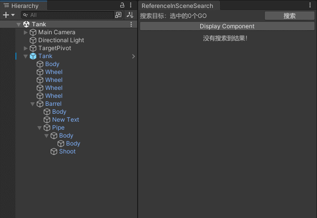  
  
* **组件搜索：** 以选中目标为搜索范围（支持多选，支持Prefab编辑场景，支持Prefab资产），将范围内所有匹配的组件显示出来。  
  * 选中某个组件脚本，可以出现自动填入类名的按钮。  
  * 当以完整类名（Assembly.GetType返回不为null）搜索时，以Type对象进行搜索，搜索结果包括派生类对象。  
  * 当以非完整类名（有命名空间，却未带命名空间）搜索时，以类名字符串进行搜索，搜索结果可能包括不同命名空间的相同类名对象，但不包括派生类对象。  
* **Layer搜索：** 以选中目标为搜索范围（支持多选，支持Prefab编辑场景，支持Prefab资产），将范围内所有匹配的节点显示出来。  
* **场景中引用搜索：** 以整个场景为搜索范围（支持Prefab编辑场景），将范围内所有引用到所选对象（支持多选）的组件显示出来。  

#### 安装方法
* 使用Unity Package Manager安装：  
  * GitHub：
  ```
  git@github.com:wy19910222/Unity-Tools.git?path=Assets/Tools/TransformSearch
  ```
  * Gitee：
  ```
  git@gitee.com:wy19910222/Unity-Tools.git?path=Assets/Tools/TransformSearch
  ```
* 直接将 [**TransformSearch**](Assets/Tools/TransformSearch) 文件夹拷贝至项目中。  

#### 使用方法
* 通过菜单项 **Tools/WYTools/TransformSearch/SearchXXX** 打开对应窗口。  


## UI编辑辅助工具

[**UITools**](Assets/Tools/UITools)  
提供对齐、同宽高、贴合、成组解组、平均行间距等操作，用于更方便地编辑UGUI。  
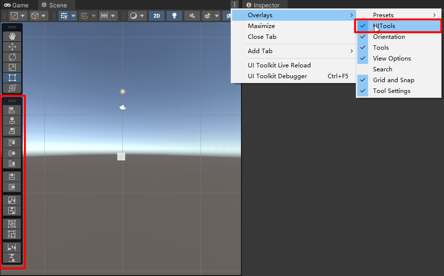  
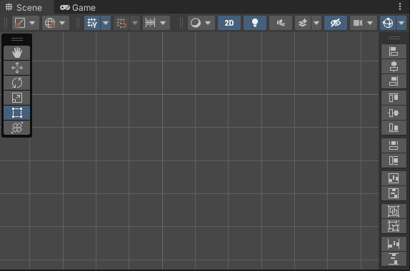  
* **对齐按钮：** 分为「上」、「中」、「下」、「左」、「中」、「右」共6个按钮。  
  当选中单个UI节点，则将该节点与父节点对齐。当选中多个UI节点，则将其他节点与第一个节点对齐。  
  当按住Shift键再点击时，会同时设置节点的轴点。  
* **同宽高按钮：** 分为「同宽」和「同高」共2个按钮。  
  当选中单个UI节点，则将该节点与父节点同宽高。当选中多个UI节点，则将其他节点与第一个节点同宽高。  
* **贴合按钮：** 分为「水平贴合」和「竖直贴合」共2个按钮。  
  将选中节点的宽高设置为包裹所有子节点的最小尺寸，由于子节点的范围不一定剧中，所以会移动节点坐标。  
  当按住Shift键再点击时，会保持节点坐标，转而修改节点的轴点。  
* **组按钮：** 分为「成组」和「解组」共2个按钮。  
  成组：在当前位置新建一个名为「Group」节点，并将选中的一个或多个节点设为该节点的子节点。  
  解组：如果选中的节点名称为「Group」，则将其所有子节点设为该节点的父节点的子节点，并删除该节点。  
* **行间距按钮：** 分为「平均间距」和「平均行距」共2个按钮。  
  平均间距：以选中的多个节点的最左边节点和最右边节点为两端，平均分布节点间的间距。  
  平均行距：以选中的多个节点的最下边节点和最上边节点为两端，平均分布节点间的行距。  
  当按住Shift键再点击时，将会重新定义缝隙（广义缝隙）。  

#### 安装方法
* 使用Unity Package Manager安装：  
  * GitHub：
  ```
  git@github.com:wy19910222/Unity-Tools.git?path=Assets/Tools/UITools
  ```
  * Gitee：
  ```
  git@gitee.com:wy19910222/Unity-Tools.git?path=Assets/Tools/UITools
  ```
* 直接将 [**UITools**](Assets/Tools/UITools) 文件夹拷贝至项目中。  

#### 使用方法
* Unity2021.2及之后版本：在场景窗口的右上角菜单中，勾选 **Overlays/UITools** 即可出现工具栏。  
  * 拖动工具栏头部两根线条，可以选择停靠模式或悬浮模式。  
  * 右键工具栏头部两根线条，可以选择折叠模式或展开模式。  
  * 悬浮模式下，右键工具栏头部两根线条，可以选择横向布局或纵向布局。  
* Unity2021.2之前版本：通过菜单项 **Tools/WYTools/UITools** 打开窗口。  
  * 窗口高度大于等于100时，按钮纵向排列。  
  * 窗口高度小于100时，按钮横向排列。  


## UGUI扩展

[**UGUIExt**](Assets/Tools/UGUIExt)  
慢慢添加中。  
* **ImageAnimation：** 将多个Sprite以序列帧的形式播放。  
* **RawImageAnimation：** 将多个Texture以序列帧的形式播放。  
* **OutlineMellow：** 支持调节层数，从而实现更圆滑的描边。  
* **TemplateText：** 以模板形式赋值文本框，从而实现把文案留在UI界面中，而代码单独控制文案中的变量。  
* **ContentSizeFitterExt：** 增加最大宽高和最小宽高功能，可实现文本框尺寸在字少的时候横向适应文本宽度，字多的时候纵向适应行数的需求。  

### 依赖
依赖 **UGUI** 和 **TextMeshPro** 。  

#### 安装方法
* 使用Unity Package Manager安装：  
  * GitHub：
  ```
  git@github.com:wy19910222/Unity-Tools.git?path=Assets/Tools/UGUIExt
  ```
  * Gitee：
  ```
  git@gitee.com:wy19910222/Unity-Tools.git?path=Assets/Tools/UGUIExt
  ```
* 直接将 [**UGUIExt**](Assets/Tools/UGUIExt) 文件夹拷贝至项目中。  

#### 使用方法
* 按需使用对应组件即可。  


## Transform检视面板扩展

[**TransformInspector**](Assets/Tools/TransformInspector)  
在Transform检视面板最左侧区域新增右键菜单，添加「重置」、「保留2位小数」、「显示Global」三个功能。  
在RectTransform检视面板末尾区域新增「保留整数」、「保留2位小数」两个按钮。  
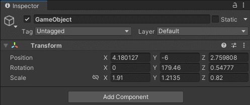  
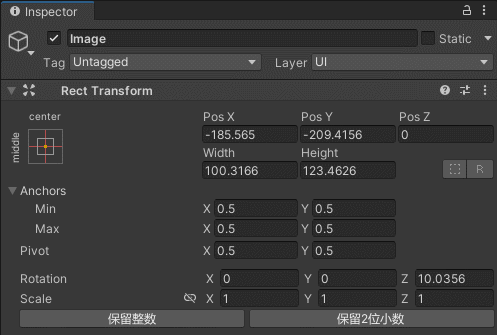  

#### 安装方法
* 使用Unity Package Manager安装：  
  * GitHub：
  ```
  git@github.com:wy19910222/Unity-Tools.git?path=Assets/Tools/TransformInspector
  ```
  * Gitee：
  ```
  git@gitee.com:wy19910222/Unity-Tools.git?path=Assets/Tools/TransformInspector
  ```
* 直接将 [**TransformInspector**](Assets/Tools/TransformInspector) 文件夹拷贝至项目中。  

#### 使用方法
* 如图所示。  


## SpriteAtlas检视面板扩展

[**SpriteAtlasInspector**](Assets/Tools/SpriteAtlasInspector)  
在SpriteAtlas检视面板末尾区域新增「去重」、「深入文件夹去重」、「清空列表」、「添加选中对象」四个按钮。  
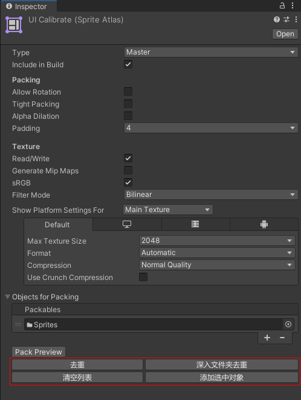  
* **去重：** 去除列表中重复的项。  
* **深入文件夹去重：** 列表中的文件夹如果包含列表中的其他项，也将去除重复的项。  
* **清空列表：** 清空列表。  
* **添加选中对象：** 将当前选中的所有对象添加到列表末尾。  

#### 安装方法
* 使用Unity Package Manager安装：  
  * GitHub：
  ```
  git@github.com:wy19910222/Unity-Tools.git?path=Assets/Tools/SpriteAtlasInspector
  ```
  * Gitee：
  ```
  git@gitee.com:wy19910222/Unity-Tools.git?path=Assets/Tools/SpriteAtlasInspector
  ```
* 直接将 [**SpriteAtlasInspector**](Assets/Tools/SpriteAtlasInspector) 文件夹拷贝至项目中。  

#### 使用方法
* 如图所示。  


## EasySplinePath2D插件修改

[**EasySplinePath2DPlus**](Assets/Tools/EasySplinePath2DPlus)  
在EasySplinePath2D插件的基础上，实现样条线的2.5D化（支持z轴移动、x轴旋转和y轴旋转）。  
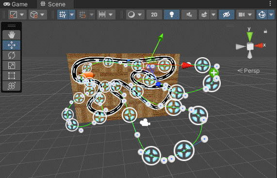  
* 支持z轴移动，意味着可以放到3D场景中了。  
* 支持x轴旋转和y轴旋转，意味着可以将样条线水平放置。  
* Scene窗口视角缩放时，节点图标跟着一起缩放，使节点图标看起来像是个3D场景中的物体。  
* 支持在3D模式下，样条线完整的编辑功能。  

#### 安装方法
1. 购买AssetStore上正版的 [**EasySplinePath2D**](https://assetstore.unity.com/packages/tools/utilities/easy-spline-path-2d-127710) 插件，
  或将 [**EasySplinePath2D**](Assets/Tools/EasySplinePath2D) 文件夹拷贝至项目中（该文件夹只用于配合EasySplinePath2DPlus，商业化使用请购买正版）。  
2. 将 [**EasySplinePath2DPlus**](Assets/Tools/EasySplinePath2DPlus) 文件夹拷贝至项目中。  

#### 使用方法
* 将 EasySplinePath2D 组件替换成 EasySplinePath2DPlus 组件即可。  


## 音频裁剪器&音频统一音量

[**AudioClipper**](Assets/Tools/AudioFactory/Editor/AudioClipper.cs)  
支持展示AudioClip对象的波形图，从中截取片段，试听并保存为wav、mp3、ogg文件。  
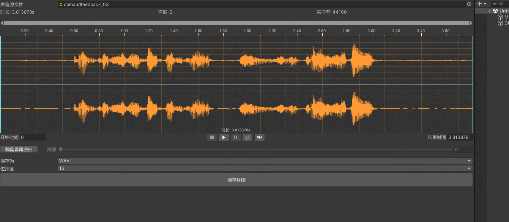  
* 展示带标尺的波形图。  
* 可在波形图中选中截取区域，并支持拖动区域。  
* 可根据阈值裁剪收尾空白。  
* 可试听截取的片段。  
* 可缩放音量，并在波形图中展示出来。  
* 可保存片段到WAV、Mp3、Ogg等音频文件。  

[**AudioVolumeUnify**](Assets/Tools/AudioFactory/Editor/AudioVolumeUnify.cs)  
本工具用于将多个音频统一音量，支持WAV、MP3、OGG三种格式。  
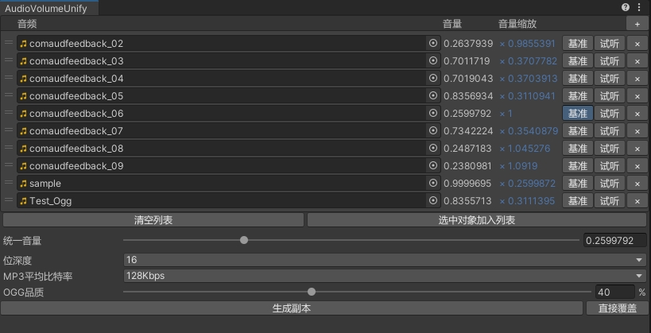  
* 可选择某个音频的音量作为统一音量，也可以自己设置统一音量。  
* 支持以统一音量试音每个音频。  
* 输出文件与源文件格式相同，也可以直接覆盖源文件。  

#### 安装方法
* 使用Unity Package Manager安装：  
  * GitHub：
  ```
  git@github.com:wy19910222/Unity-Tools.git?path=Assets/Tools/AudioFactory
  ```
  * Gitee：
  ```
  git@gitee.com:wy19910222/Unity-Tools.git?path=Assets/Tools/AudioFactory
  ```
* 直接将 [**AudioEditor**](Assets/Tools/AudioFactory) 文件夹拷贝至项目中。  

#### 使用方法
* 通过菜单项 **Tools/WYTools/Audio Clipper** 和 **Tools/WYTools/Audio Volume Unify** 打开对应窗口。  
* 点击窗口右上角问号按钮查看使用帮助。  


## 图片裁剪器

[**ImageCropping**](Assets/Tools/ImageCropping)  
预览Texture对象，设置裁剪区域，设置圆角，预览裁剪后图片，保存为新文件。  
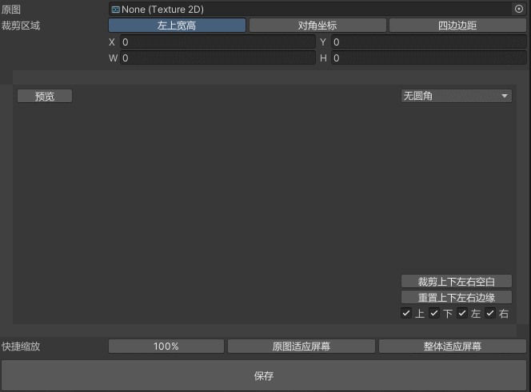  
* 以三种方式展示裁剪框数值。  
* 在带标尺和滚动条的视口中展示原图。  
* 拖动裁剪框边缘可以调整裁剪框，拖动到视口边缘可以自动滚动视口。  
* 拖动视口其他位置可以移动整个视口位置，在视口中滚动鼠标滚轮可以缩放视口。  
* 支持快捷缩放和快捷设置裁剪区域。  
* 两种方式（普通圆角矩形、小米Logo）设置裁剪后的图片的圆角。  
* 可实时预览裁剪后的图片。  
* 可保存裁剪后的图片到新文件。  

#### 安装方法
* 使用Unity Package Manager安装：  
  * GitHub：
  ```
  git@github.com:wy19910222/Unity-Tools.git?path=Assets/Tools/ImageCropping
  ```
  * Gitee：
  ```
  git@gitee.com:wy19910222/Unity-Tools.git?path=Assets/Tools/ImageCropping
  ```
* 直接将 [**ImageCropping**](Assets/Tools/ImageCropping) 文件夹拷贝至项目中。  

#### 使用方法
* 通过菜单项 **Tools/WYTools/Image Cropping** 打开对应窗口。  

